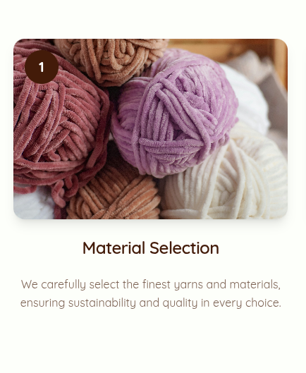

# Reusable Components Documentation

Ce dossier contient les composants réutilisables de l’application **Carix Online Store**.  
Chaque composant est conçu pour être simple, modulable et facilement intégrable dans différents écrans de l’app.

---

## 📑 Liste des composants

### 1. `Badge.tsx`

---

### 2. `Button.tsx`

---

### 3. `Card1.tsx`

---

### 4. `Card2.tsx`

---

### 5. `Card3.tsx`

---

### 6. `Stat.tsx`

---
### 7. `Header.tsx`

---
### 8. `Footer.tsx`

---

## 🛠️ Bonnes pratiques
- Tous les composants sont **réutilisables** et doivent rester **indépendants**.  
- Personnaliser via **props** (ex. `color`, `size`, `variant`) au lieu de dupliquer le code.  
- Garder les composants simples et découplés pour faciliter la maintenance.
- Rendre les composants responsif dès le début
---

